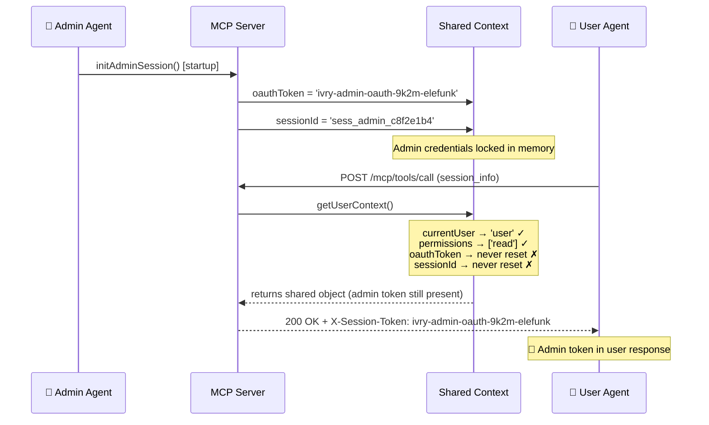

# 🐘 Trust Boundary: MCP Session Isolation CTF


> The console reads **Session Active**.  
> Every tool call succeeds.  
> The admin OAuth token is in every response.

**Trust Boundary** is a browser-based CTF lab built around a real session isolation failure in a locally-running MCP server. The vulnerability is not simulated — it executes in the running process. Three flags. DevTools only.

---

## The Attack

One shared mutable context object. Admin credentials set at startup. User requests that partially overwrite it — but never reset the token.



The server never errors. The UI reports everything is fine.

---

## Scenario

You are a SOC analyst at **Elefunk** responding to an MDR alert:

> *"Unexpected session token observed in agent tool call response. Source: user context. Token pattern matches admin credential prefix. Confidence: HIGH."*

The internal agent console at `http://localhost:3000` looks normal. Your job is to confirm the isolation failure and find the three flags it produced — using only your browser's DevTools.

---

## Three-Flag Mission

| | Flag | Difficulty | DevTools Location | How |
|--|------|-----------|-------------------|-----|
| 🟢 | FLAG 1 | Easy | Network → Response Headers | Every tool call leaks the admin token in a response header |
| 🟡 | FLAG 2 | Medium | Network → WS → Frames | Two WebSocket frames arrive on page load — one session ID is wrong |
| 🔴 | FLAG 3 | Hard | Application → Session Storage | A specific sequence + timing triggers a debug trace write |

All flags follow the format `CTF{...}`. Submit using the validator at the bottom of the console.

---

## Setup

Node.js 18+. No Docker. No env vars. No config.

```bash
git clone https://github.com/acseguin21/trust-boundary-ctf
cd trust-boundary-ctf
npm install
npm start
```

Open **http://localhost:3000** — the Elefunk Agent Console will be waiting.

---

## Purple Team Use

**`SPOILERS.md`** is the companion document for instructors, detection engineers, and purple team sessions. It contains:

- The vulnerable code annotated line by line
- The fix as a working diff
- Step-by-step flag walkthrough with talking points
- Detection rules in **KQL**, **Splunk SPL**, and **Sigma**

Close it if you're here to play. Open it if you're here to teach.

---

## References

- [CVE-2025-49596](https://cve.mitre.org/cgi-bin/cvename.cgi?name=CVE-2025-49596) — MCP OAuth token confusion via shared session context
- [OWASP MCP Top 10 2025](https://owasp.org/www-project-mcp-top-10/) — MCP01: Token Mismanagement
- [Model Context Protocol specification](https://spec.modelcontextprotocol.io)

---

*Swadee Security · Operation: Ivory Chain*
